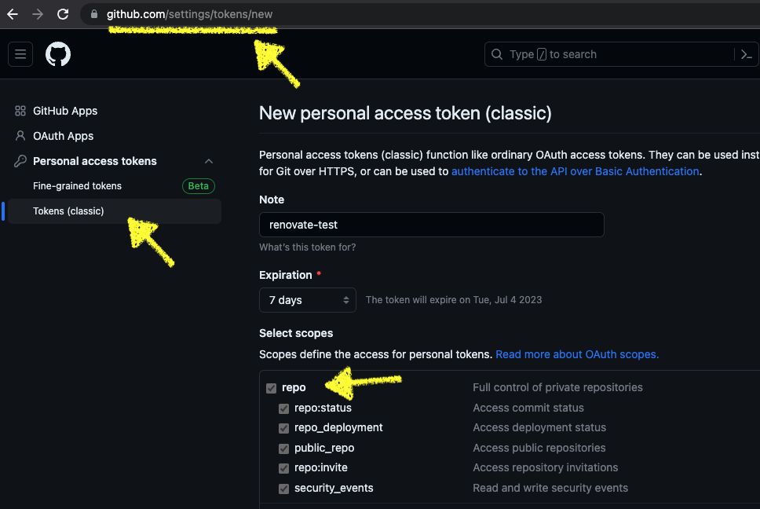

# mokuno441-renovate

## About this repository
- minimal reproduction repository for this discussion
    - https://github.com/renovatebot/renovate/discussions/22957#discussioncomment-6268367


## What this repository shows
The default value for versioning in the documented RegexManagers is semver, not semver-coerced.

## How do i know that the default value for versioning is semver correct?
I have prepared `renovate.json` with two definitions in `regexManagers`. Each has a `versioningTemplate` set to none (default value) and a `semver-coerced` value. Both releases are also non-strict semantic versions, although the target repositories are different.

When you run renovate with these settings, the repository without the `versioningTemplate` will not create a pull request, but the one with `semver-cerced` will.  

So you can see that the default value of `versioningTemplate` is `semver`.

## How to reproduce
1. Fork this repository
2. Generate a personal access token  
   
3. In a docker-enabled environment, execute the following commands
   ```bash
   docker run --rm -it renovate/renovate:35.89.1 --token={personal_access_token} {username}/mokuno441-renovate
   ```
